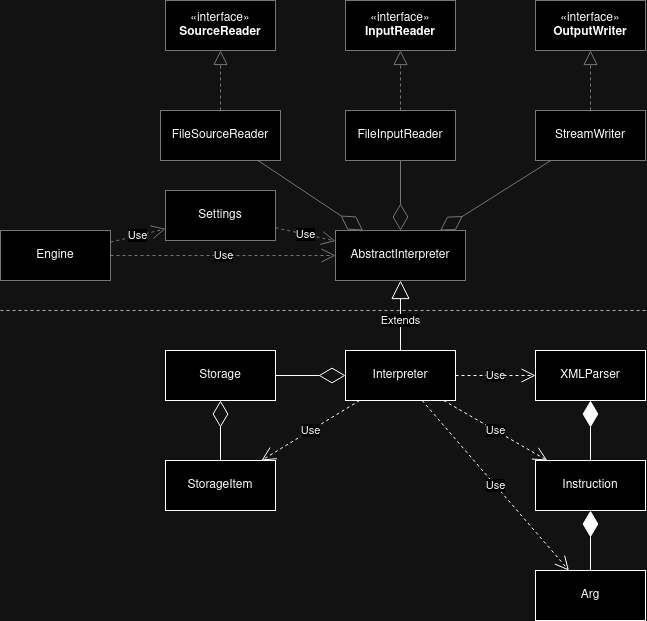

Implementační dokumentace k 2. úloze do IPP 2023/2024 
Jméno a příjmení: Martin Slezák 
Login: xsleza26

## Diagram tříd

### Základní popis

Část diagramu nad přerušovnou čarou *(šedé ohraničení buněk)* je poskytnutý
rámec `IPP-core`. Část pod přerušovanou barvou *(bílé ohraničení)* je část,
kterou jsem implementoval.

### Popis tříd (implementovaných mnou)

#### Interpreter

Třída [`Interpreter`](#interpreter) dědí z abstraktní třídy
`AbstractInterpreter`, která definuje metodu `execute()`. Tato metoda je poté
třídou [`Interpreter`](#interpreter) implementována.

Na začátku se využije třída [`XMLParser`](#xmlparser)
*(konkrétně metoda `parse`)*, které se předá objekt
`DOMDocument`, který byl získán pomocí atributu [`Interpreter`u](#interpreter)
a to objektem třídy `FileSourceReader`. Více je popsáno v sekci
[XMLParser](#xmlparser).

Následuje přístup k atributu [`XMLParser`u](#xmlparser) `instructions`, který
obsahuje zparsované instrukce. Ty jsou poté seřazeny na základě atributu
`order` z XML a je zahájena interpretace jako taková.

[`Interpreter`](#interpreter) také obsahuje implementované instrukce a některé
poté využívají objekt třídy [`Storage`](#storage) pro přístup do simulované
paměti. O paměti více v sekci [Storage](#storage).

Interpretace je ukončena v případě některé z chybových sitací nebo při využití
instrukce `EXIT` a nebo při vykonání všech instrukcí.

#### XMLParser

Třída [`XMLParser`](#xmlparser) obsahuje atribut `instructions`, což je pole
objektů třídy [`Instruction`](#instruction). Obsahuje také metodu
`parse(DOMDocument $dom)`, která dostane objekt `DOMDocument` obsahující
načtené XML, který poté parsuje a jednotlivé instrukce ukládá jako objekt třídy
[`Instruction`](#instruction) do atributu `instructions`.

#### Storage

Třída [`Storage`](#storage) reprezentuje simulovanou pamět, která obsahuje
jednotlivé paměťové rámce jako atributy. Dále má také atributy pro zásobník,
zásobník paměťových rámců, zásobník volání a asociované pole návěští, které
jako klíč má název návěští a hodnotu pořadí instrukce.

Jednotlivé paměťové rámce poté obsahují objekty třídy
[`StorageItem`](#storageitem), které reprezentují proměnnou v paměti. Při
přístupu k proměnné se poté pracuje právě s objektem této třídy.

Tato třída implementuje veškerou práci s paměťovými rámci, jakožto definování
proměnné, ukládání hodnoty do proměnné, přístup k proměnné, vytvoření nového
dočasného rámce, uložení dočasného rámce na zásobník rámců a tak dále.

#### StorageItem

Reprezentuje proměnnou v paměti *(je ale využívána při interpretaci pro*
*všechny symboly)*. Obsahuje atribut `type`, který určuje typ symbolu, a také
`value`, což je hodnota symbolu.

#### Instruction

Tato třída reprezentuje instrukci a obsahuje atribut `opcode`, který uchovává
instrukci jako takovou, a pak také pole objektů třídy [`Arg`](#arg), které
obsahuje všechny argumenty, které instrukce dostala.

#### Arg

Třída využívána pro reprezentaci instrukce. Tato třída je využívána třídou
[`Interpreter`](#interpreter) pro přístup k jednotlivým argumentům instrukce.

#### Vyjímky

Každý chybový kód obsahuje také svoji vyjímku, které jsem implementoval ve
složce Exception. Tyto vyjímku dědí třídu `IPPException`. Také jsem využil
některé vyjímky přímo z `IPPCore`. Pro přehlednost jsem vyjímku vynechal z
[Diagramu tříd](#diagram-tříd), protože jich je mnoho.
